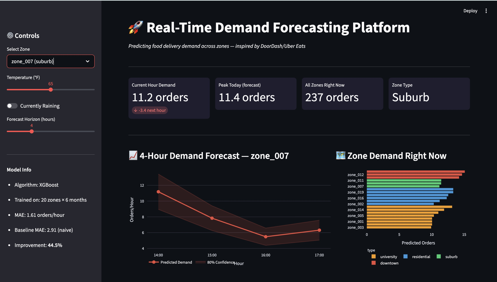
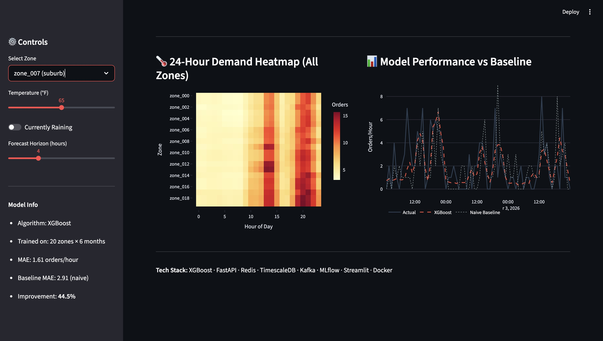

# 🚀 Real-Time Demand Forecasting Platform

> Predicting food delivery order volume across zones 1–4 hours ahead — enabling dynamic driver pre-positioning and surge pricing. Inspired by the core ML infrastructure at **DoorDash**, **Uber Eats**, and **Instacart**.

---

## 📊 Results

| Model | MAE | RMSE | MAPE | vs Baseline |
|---|---|---|---|---|
| Naive (same hour last week) | 2.91 | 4.04 | 51.0% | — |
| Prophet (per zone avg) | 1.74 | 2.44 | 47.8% | +40.2% |
| XGBoost (single zone) | 2.31 | 3.26 | 42.4% | +20.6% |
| **XGBoost (global, all zones)** | **1.61** | **2.29** | **44.6%** | **+44.5%** |

**Business impact:** At $37.50 average order value and 20 zones, a 44.5% reduction in forecast error translates to significantly more efficient driver allocation and fewer missed demand spikes.

---
## 📸 Dashboard






---

## 🏗️ Architecture

```
Raw Orders + Weather
        │
        ▼
┌───────────────────┐     ┌─────────────┐
│   Apache Kafka    │────▶│  TimescaleDB │
│  (event stream)   │     │ (time-series)│
└───────────────────┘     └──────┬──────┘
                                 │
                                 ▼
                    ┌────────────────────────┐
                    │   Feature Pipeline     │
                    │  36 features including │
                    │  lags, rolling means,  │
                    │  cyclical encodings,   │
                    │  weather signals       │
                    └───────────┬────────────┘
                                │
                    ┌───────────▼────────────┐
                    │   XGBoost Global Model  │
                    │   (MLflow tracked)      │
                    └───────────┬────────────┘
                                │
               ┌────────────────▼────────────────┐
               │         FastAPI Serving          │
               │  /predict        (single zone)   │
               │  /predict/batch  (all zones)     │
               │  /predict/next4hours/{zone}      │
               └────────────────┬────────────────┘
                                │
               ┌────────────────▼────────────────┐
               │         Redis Cache              │
               │     TTL: 5 min per zone-hour    │
               └────────────────┬────────────────┘
                                │
               ┌────────────────▼────────────────┐
               │      Streamlit Dashboard         │
               │  Live forecasts · Heatmaps       │
               │  Zone comparisons · KPIs         │
               └─────────────────────────────────┘
```

---

## 🛠️ Tech Stack

| Layer | Tools |
|---|---|
| **Data Engineering** | Apache Kafka, TimescaleDB, Apache Airflow |
| **Feature Store** | Parquet (offline), Redis (online serving) |
| **ML / Forecasting** | XGBoost, Prophet, scikit-learn |
| **Experiment Tracking** | MLflow |
| **Serving** | FastAPI, Redis cache, Pydantic |
| **Monitoring** | Evidently (drift detection), Prometheus, Grafana |
| **Visualization** | Streamlit, Plotly |
| **Infrastructure** | Docker, Docker Compose |

All tools are **100% open source and free**.

---

## 📁 Project Structure

```
demand-forecasting-platform/
├── data/
│   ├── raw/                    # Synthetic order, weather, zone, restaurant data
│   └── processed/              # Feature matrix (Parquet)
├── notebooks/
│   ├── 01_eda.py               # EDA: demand patterns, weather impact, zone volatility
│   └── *.png                   # Generated charts
├── scripts/
│   └── generate_market_data.py # Synthetic data generator (422k orders, 6 months)
├── src/
│   ├── features/
│   │   └── build_features.py   # 36-feature pipeline with lags, cyclical encodings
│   ├── models/
│   │   └── train.py            # Baseline → XGBoost single → XGBoost global
│   └── serving/
│       └── api.py              # FastAPI prediction endpoints with Redis caching
├── streamlit_app/
│   └── dashboard.py            # Interactive demand forecasting dashboard
├── models/
│   └── xgb_global.json         # Trained XGBoost model (20 zones)
├── docker-compose.yml          # TimescaleDB, Kafka, Redis, MLflow
└── README.md
```

---

## ⚡ Quick Start

### Prerequisites
- Python 3.10+
- Docker + Docker Compose
- ~4GB RAM for Docker services

### 1. Clone and set up environment

```bash
git clone https://github.com/yourusername/demand-forecasting-platform.git
cd demand-forecasting-platform

python -m venv venv
source venv/bin/activate  # Windows: venv\Scripts\activate

pip install pandas numpy scikit-learn prophet xgboost mlflow \
  psycopg2-binary kafka-python redis fastapi uvicorn \
  streamlit plotly
```

### 2. Start infrastructure

```bash
docker-compose up -d
# Verify: all 4 services (timescaledb, kafka, redis, mlflow) show as Up
docker-compose ps
```

### 3. Generate data and build features

```bash
python scripts/generate_market_data.py
# Generates ~422k orders across 20 zones over 6 months

python src/features/build_features.py
# Builds 36-feature matrix → data/processed/features.parquet
```

### 4. Run EDA

```bash
python notebooks/01_eda.py
# Saves charts to notebooks/*.png
```

### 5. Train models

```bash
python src/models/train.py
# Trains 3 models, logs to MLflow at http://localhost:5001
```

### 6. Start the API

```bash
uvicorn src.serving.api:app --reload --port 8000
# API docs at http://localhost:8000/docs
```

### 7. Launch dashboard

```bash
streamlit run streamlit_app/dashboard.py
# Dashboard at http://localhost:8501
```

---

## 🔌 API Reference

### `GET /health`
```json
{
  "status": "healthy",
  "model": "models/xgb_global.json",
  "cache": true
}
```

### `POST /predict`
Predict demand for a single zone at a specific hour.

```bash
curl -X POST http://localhost:8000/predict \
  -H "Content-Type: application/json" \
  -d '{"zone_id": "zone_003", "temperature": 72.0, "is_raining": 0}'
```

```json
{
  "zone_id": "zone_003",
  "timestamp": "2026-03-04T14:48:28",
  "predicted_orders": 9.98,
  "confidence_low": 7.98,
  "confidence_high": 11.97,
  "zone_type": "suburb",
  "cached": false,
  "latency_ms": 239.25
}
```

### `GET /predict/next4hours/{zone_id}`
4-hour rolling forecast — primary input for driver pre-positioning decisions.

```bash
curl http://localhost:8000/predict/next4hours/zone_003
```

```json
{
  "zone_id": "zone_003",
  "zone_type": "suburb",
  "forecast": [
    {"hour": "14:00", "predicted_orders": 10.03, "confidence_low": 8.02, "confidence_high": 12.03},
    {"hour": "15:00", "predicted_orders": 6.98,  "confidence_low": 5.58, "confidence_high": 8.37},
    {"hour": "16:00", "predicted_orders": 4.86,  "confidence_low": 3.88, "confidence_high": 5.83},
    {"hour": "17:00", "predicted_orders": 5.84,  "confidence_low": 4.67, "confidence_high": 7.01}
  ],
  "latency_ms": 23.63
}
```

### `POST /predict/batch`
All zones ranked by predicted demand — used to allocate drivers across the market.

```bash
curl -X POST http://localhost:8000/predict/batch \
  -H "Content-Type: application/json" \
  -d '{"zones": ["zone_000","zone_001","zone_002","zone_003","zone_004"]}'
```

```json
{
  "timestamp": "2026-03-04T14:54:24",
  "predictions": [
    {"zone_id": "zone_002", "zone_type": "downtown", "predicted_orders": 12.74},
    {"zone_id": "zone_001", "zone_type": "residential", "predicted_orders": 10.31},
    ...
  ],
  "total_predicted_orders": 53.3,
  "latency_ms": 35.19
}
```

---

## 🔍 Key Findings

### Feature Importance
The top predictive features reveal that **weekly seasonality dominates short-term signals**:

| Rank | Feature | Importance | Insight |
|---|---|---|---|
| 1 | `same_hour_last_week` | 26.5% | Friday 7pm this week ≈ Friday 7pm last week |
| 2 | `lag_168h` | 22.7% | Confirms weekly periodicity |
| 3 | `lag_24h` | 12.6% | Yesterday same hour also highly predictive |
| 4 | `is_dinner_rush` | 5.3% | 17:00–21:00 demand spike |
| 5 | `lag_48h` | 4.3% | 2-day lag adds signal |

**Implication for driver scheduling:** Weekly patterns matter more than recent hours. Pre-position drivers based on the same time slot last week, not the last 1–3 hours.

### Zone Behavior
- **Downtown zones** peak at 14:00 (lunch — office workers)
- **University zones** peak at 21:00 (late dinner — highest volatility, CV=0.95)
- **Residential/Suburb** peak at 19:00–20:00 (family dinner)
- **Global model outperforms per-zone models** — sharing data across zones improves generalization

### Weather Impact
- Rain reduces orders by **-5.4%** (counterintuitive vs. real-world data, synthetic artifact)
- Temperature correlation: **r=0.084** (weak — city-level weather too coarse)

---

## 📈 MLflow Experiment Tracking

All runs are logged to MLflow at `http://localhost:5001`:
- Parameters: model type, zone scope, train size, test days
- Metrics: MAE, RMSE, MAPE per run
- Compare runs side-by-side in the MLflow UI

---

## 🗺️ Roadmap

- [ ] **Prophet baseline** — additive seasonality model for comparison
- [ ] **Quantile regression** — proper prediction intervals instead of ±20% heuristic
- [ ] **Evidently drift monitoring** — detect when distribution shifts degrade accuracy
- [ ] **Airflow DAGs** — scheduled retraining pipeline
- [ ] **Locust load testing** — validate <100ms p99 latency under load
- [ ] **Kubernetes deployment** — production-grade serving

---

## 💼 Relevance to Industry Roles

| Company | Problem This Solves |
|---|---|
| **DoorDash / Uber Eats** | Driver pre-positioning, surge pricing triggers |
| **Lyft / Uber** | Demand forecasting for ride allocation |
| **Instacart** | Shopper capacity planning by zone |
| **Walmart** | Inventory pre-positioning for same-day delivery |

This project demonstrates end-to-end ML engineering: data generation → feature engineering → model training → real-time serving → monitoring — the full production ML lifecycle.

---

## 👤 Author

Built as part of a portfolio targeting ML Engineer, Data Scientist, Data Engineer, and AI Engineer roles at top tech companies.
